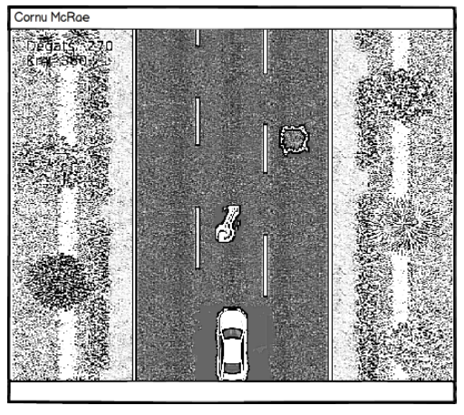

<!-- CAR GAMES PROJECT -->
<!--
*** I'm using markdown "reference style" links for readability.
*** Reference links are enclosed in brackets [ ] instead of parentheses ( ).
*** See the bottom of this document for the declaration of the reference variables
*** for contributors-url, forks-url, etc. This is an optional, concise syntax you may use.
*** https://www.markdownguide.org/basic-syntax/#reference-style-links
-->
<!-- [![Contributors][contributors-shield]][contributors-url]
[![Forks][forks-shield]][forks-url]
[![Stargazers][stars-shield]][stars-url]
[![Issues][issues-shield]][issues-url]
[![MIT License][license-shield]][license-url]
[![LinkedIn][linkedin-shield]][linkedin-url]-->


<!-- PROJECT LOGO -->
<br />
<p align="center">
  <a href="https://github.com/QuentinDesse/Domotique">
    
  </a>

  <h3 align="center">CAR GAMES PROJECT</h3>

  <p align="center">
  The repo of the project of 1nd year of Higher Technical Certificate (BTS SN IR)
    <br />
    <a href="https://github.com/github_username/repo"><strong>Explore the docs »</strong></a>
    <br />
    <br />
    <a href="https://github.com/github_username/repo">View Demo</a>
    ·
    <a href="https://github.com/github_username/repo/issues">Report Bug</a>
    ·
    <a href="https://github.com/github_username/repo/issues">Request Feature</a>
  </p>
</p>


<!-- TABLE OF CONTENTS -->
## Table of Contents

* [About the Project](#about-the-project)
  * [Built With](#built-with)
* [Getting Started](#getting-started)
  * [Prerequisites](#prerequisites)
  * [Installation](#installation)
* [Usage](#usage)
* [Contributing](#contributing)
* [Contact](#contact)
* [Useful link and ressources](#Useful-link-and-ressources)


<!-- ABOUT THE PROJECT -->
## About The Project

The objective of the project is to design a windows application and an Android home automation management application.
Home automation is a technology that makes it possible to better manage household electrical devices on a daily basis by increasing comfort, ease of use and security while saving energy.
Thus the lighting control, the heating management, the shutter control, the control of access points like gates, 
are accessible and configurable by the user at any time using a connected computer to the network, a tablet or a smartphone.


------------------------------------------------
<table>
    <thead>
        <tr>
            <th align="center">Studens of the project</th>
            <th align="center">Teatchers</th>
            <th align="center">High school Paul Cornu</th>
            <th align="center">BTS Systèmes Numériques/th>
        </tr>
    </thead>
    <tbody>
        <tr>
            <td align="center">Dominguez-Condé Alexis</td>
            <td align="center">Dossier Sebastien</td>
            <td align="center">9 Rue Paul Cornu, 14100 Lisieux</td>
            <td align="center">Option A Informatique et Réseaux</td>
        </tr>
        <tr>
            <td align="center">Desse Quentin</td>
            <td align="center"></td>
            <td align="center"></td>
            <td align="center"></td>
        </tr>
        <tr>
            <td align="center">Aubert Nathan</td>
            <td align="center"></td>
            <td align="center"></td>
            <td align="center"></td>
        </tr>
    </tbody>
</table>

### Built With

* [C++](https://fr.wikipedia.org/wiki/C%2B%2B)
* [Java](https://fr.wikipedia.org/wiki/Java_(langage))
* [C++ Builder](https://fr.wikipedia.org/wiki/C%2B%2BBuilder)


<!-- GETTING STARTED -->
## Getting Started
### Prerequisites

* [C++ Builder]
This is an example of how to list things you need to use the software and how to install them.
* npm
```sh
npm install npm@latest -g
```

### Installation
 
1. Clone the repo
```sh
git clone https://github.com/github_username/Project-Name.git
```
2. Install NPM packages
```sh
npm install
```


<!-- USAGE EXAMPLES -->
## Usage
<p align="center">
  <a href="#">
    
    <a>
  </p>


<!-- CONTRIBUTING -->
## Contributing

1. Create a [fork](https://help.github.com/en/github/getting-started-with-github/fork-a-repo) of this project
2. Clone the project:
```sh
git clone https://github.com/<YOUR_GITHUB_USERNAME>/DomotiqueBuilder
```
3. Create your Feature Branch (`git checkout -b feature/AmazingFeature`)
4. Commit your Changes (`git commit -m 'Add some AmazingFeature'`)
5. Push to the Branch (`git push origin feature/AmazingFeature`)
6. Open a Pull Request

<!-- CONTACT -->
## Contact
* Student n°1 : [https://github.com/QuentinDesse](https://github.com/QuentinDesse)
* Student n°2 : [https://github.com/Aredi](https://github.com/Aredi)

<!-- Useful link and ressources -->
## Useful link and ressources

* [DLL of the card K8055.](https://seththefly.fr/download/k8055-dll/)
* [serveur socket](https://fr.wikipedia.org/wiki/Socket)
* [c++ Builder](https://fr.wikipedia.org/wiki/C%2B%2BBuilder)
* [Android studio](https://developer.android.com/studio)


<!-- MARKDOWN LINKS & IMAGES -->
<!-- https://www.markdownguide.org/basic-syntax/#reference-style-links -->
[contributors-shield]: https://img.shields.io/github/contributors/othneildrew/Best-README-Template.svg?style=flat-square
[contributors-url]: https://github.com/othneildrew/Best-README-Template/graphs/contributors
[forks-shield]: https://img.shields.io/github/forks/othneildrew/Best-README-Template.svg?style=flat-square
[forks-url]: https://github.com/othneildrew/Best-README-Template/network/members
[stars-shield]: https://img.shields.io/github/stars/othneildrew/Best-README-Template.svg?style=flat-square
[stars-url]: https://github.com/othneildrew/Best-README-Template/stargazers
[issues-shield]: https://img.shields.io/github/issues/othneildrew/Best-README-Template.svg?style=flat-square
[issues-url]: https://github.com/othneildrew/Best-README-Template/issues
[license-shield]: https://img.shields.io/github/license/othneildrew/Best-README-Template.svg?style=flat-square
[license-url]: https://github.com/othneildrew/Best-README-Template/blob/master/LICENSE.txt
[linkedin-shield]: https://img.shields.io/badge/-LinkedIn-black.svg?style=flat-square&logo=linkedin&colorB=555
[linkedin-url]: https://linkedin.com/in/othneildrew
[product-screenshot]: images/screenshot.png
